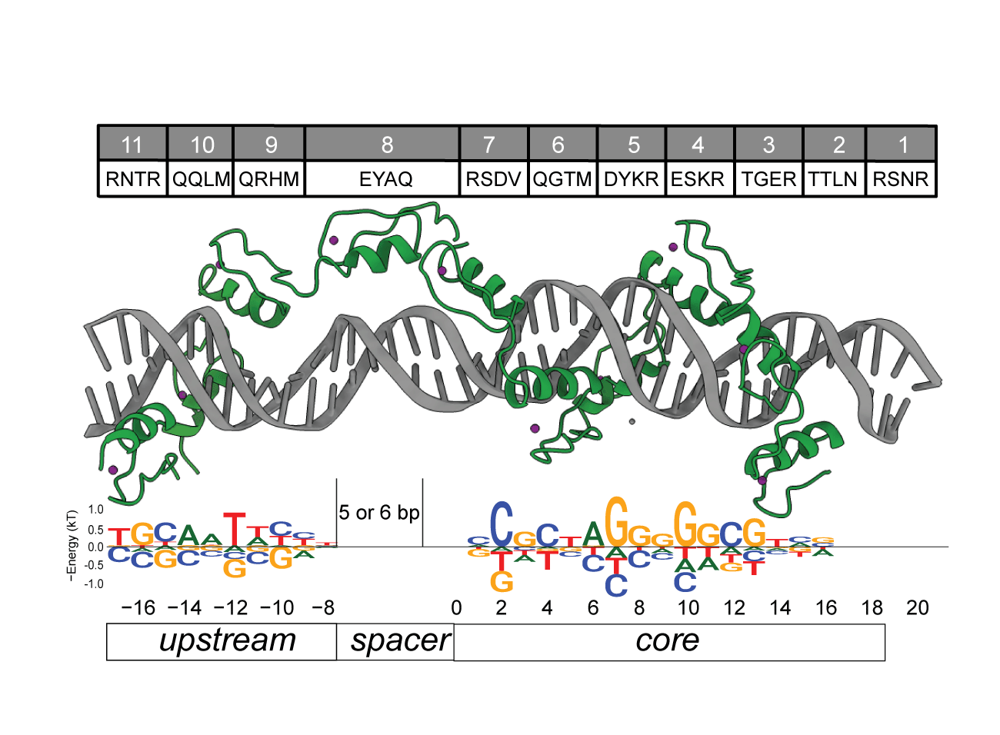

# Transcription Factor Cookbook
TFCookbook is a R package used to model and analyze protein-DNA interactions data, and predict specific *in vivo* binding sites in principled way. It is currently developed and maintained by Zheng Zuo. The acompanying paper to describe the modeling principles behind this package can be accessed through (https://www.lidsen.com/journals/genetics/genetics-05-03-134#).

### Installation instruction:
You can pull and install TFCookbook package through R command: 
`remotes::install_github("zeropin/TFCookbook")`

### Acknowledgement:
Some function of this package, such as matchPEM, is derived and modified from other packages [motifmatchr](https://github.com/GreenleafLab/motifmatchr) and [MOODS](https://github.com/jhkorhonen/MOODS). I want to thank their generous sharing of the source codes and permission for reuse.

Please do not hesitate to contact me if you have any issue.

Zheng Zuo
zeropin@live.cn
