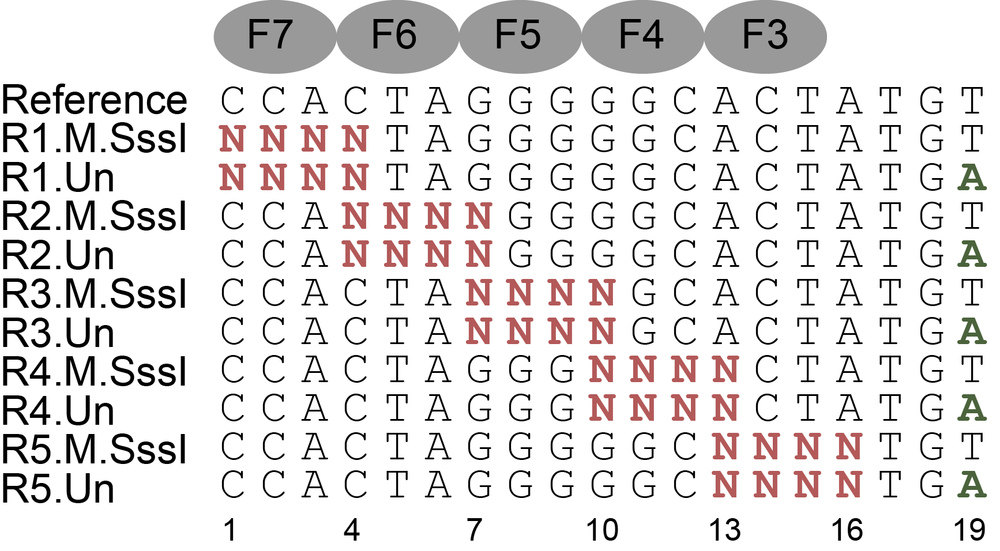

```{r include=FALSE}
require(dplyr)
require(stringi)
require(ggplot2)
require(ggrepel)
CTCF.reference = "CCACTAGGGGGCACTATGT"

addFingers <- function(index, yMin = -1, yMax = 1, breaks = NULL){
  if(is.null(breaks))
    breaks = seq(1,100,3)
  
  fingers <- list()
  for(i in 1:length(index)){
        fingers[[2*i-1]] <- ggplot2::annotate('rect', xmin = breaks[i]-0.5, xmax = breaks[i+1] - 0.5,
                          ymin = yMin, ymax = yMax, alpha = 0.2, fill = ifelse(i%%2==1, 'grey', 'black'))
        fingers[[2*i]] <- ggplot2::annotate('text', x = breaks[i]+1, y = yMax-0.1,
                          label = paste('F', index[i], sep = "" )) 
        
  }
  return(fingers)
}
```

## Background and Introduction

The CTCF protein, consisting of 11 tandem C2H2-type zinc fingers, is known to be critical insultor for genome architecture in mammals. Its finger 3 to 7 has been shown to recognize underlying reference sequence and motif strongly. Also It was known that CTCF processes some methylation sensitivity, i.e., when some CpG dinucleotide gets methylated within the binding site, the affinity of CTCF to the methylated sites gets compromised. To systematically investigate the specificity and methylation sensitivity of mouse CTCF protein, I designed and synthesized the following dsDNA libraries, covering every single and adjacent double variants of the core binding sites recognized by F3-F7. Position 19 serves as the barcode position to indicate wheather each sequence is treated by M.SssI methylated beforehand or not (For M.SssI treatment, only CpG dinucleotide can get methylated).





## Importing and preprocessing data
```{r}
load("../data/CTCF.rda")
(CTCF <- CTCF %>%
  dplyr::mutate(`Bound/Unbound` = Bound/Unbound,
                Energy = -log(Bound/Unbound)))
```


```{r eval=FALSE, include=FALSE}
CTCF %>%
  filter(Property == "un", stri_detect_regex(Sequence, "CCACTAGGGCACACTA")) %>%
  arrange(Energy)
```

## Building regular specificity model from unmethylated sites

It is easy to build specificity model and derive motif based on energy values from those unmethylated sites only.
```{r fig.height=4.5, fig.width=8, warning=FALSE}
CTCF.Model.3Lp1<- CTCF %>%
  dplyr::filter(Property == "un") %>% # Select those untreated sites
  TFCookbook::buildEnergyModel(encoding = "3L+1")

CTCF.Model.3Lp1%>%
  TFCookbook::getEnergyMatrix() -> CTCF.Core.Matrix
  TFCookbook::plotEnergyLogo() +
  addFingers(index = 7:3, yMin =  -1.4, yMax = 1.4) +
  labs(title = "Specificity profile of CTCF(F1-F9)\n based on energy values from unmethylated sites only") +
  theme(plot.title = element_text(hjust = 0.5))

#ggsave("Regular motif.svg", plot = last_plot(), height = 4.5, width = 9)
```


## Building Methylation Sensitivity model

### Pairwise comparison of unmethylated sites and M.SssI treated sites

Since the designed libraries cover both M.SssI treated and untreated sequences in one-to-one correspondence, it is possible to do pairwise comparison for each site. Note that M.SssI treatment doesn't necessarily mean methylation of cytosine, only those cytosines within CpG dinucleotide can get methylated, therefore those CpG-non-containing sequences can serve as negative control to gauge the intrinsic variances of our Methyl-Spec-seq measurement.

```{r warning=FALSE}
CTCF.pairwise <- inner_join(subset(CTCF, Property=="un"),
                            subset(CTCF, Property=="me"), by = "Sequence") %>%
  dplyr::select(Sequence,
                Energy.un = `Energy.x`,
                Energy.me = `Energy.y`) %>%
  dplyr::mutate(CpG.containing = as.integer(stringi::stri_count_fixed(Sequence, "CG")),
                Energy = Energy.me - Energy.un)

CTCF.pairwise %>%
  dplyr::arrange(desc(Energy)) %>%
  dplyr::filter(Energy.un <= 1.5) %>%
  dplyr::rename(`Number of CpG sites` = CpG.containing,
                `Methylation effect (kT)` = Energy)
```

Clearly, for those high-affinity, or low-binding energy sequences, C<span style="color: red;">CG</span>GTAGGGGGCACTA deviate significantly from the diagnoal lines by up to ~1kT, whereas almost all non-CpG containing sites fall within the 0.25kT energy deviation bounds, so in our measurement mCpG at position 2 significantly compromise the binding affinity of CTCF, which is consistent with previous literature report. For those weak binding sites, there are certain degree of divergence, very likely because of the alternative recognition mode of CTCF including the nearby barcode position, thus we consider that could be technical artifact.


```{r warning = FALSE, fig.height=5.5, fig.width=8}
CTCF.pairwise %>%
  dplyr::mutate(Label = if_else(abs(Energy.un - Energy.me)> 1, Sequence, ""), 
                CpG.containing = as.factor(CpG.containing)) %>%
  ggplot(aes(x = Energy.un, y = Energy.me, shape = CpG.containing, color = CpG.containing, label = Label)) +
  geom_point() +
  geom_abline(intercept = -0.25, slope = 1, linetype="dashed") +
  geom_abline(intercept = 0.25, slope = 1, linetype="dashed") +
  geom_text_repel(show.legend = FALSE, force = 10) +
  ggtitle("Binding energy comparison between M.SssI treated and untreated sites") +
  scale_x_continuous(breaks = seq(-2, 4, 1)) + scale_y_continuous(breaks = seq(-2, 4, 1)) +
  xlab("Binding energy for untreated sites (kT)") +
  ylab("Binding energy for M.SssI treated sites (kT)") +
  labs(shape = "Number of CpGs within sequence", color = "Number of CpGs within sequence") +
  theme(legend.position = "bottom", plot.title = element_text(hjust = 0.5))

#ggsave("Pairwise comparison.svg", plot = last_plot(), height = 5.7, width = 8)
```


### Building Methylation sensitivity model by regression of 4L+1 parameters all together

As discussed in the main text, if we use encoding scheme (3+1)L+1 and do regression analysis with all 4L+1 parameters altegether, we can get some methylation profiles shown below, which is very different from what we expect based on visual inspection, e.g., position 2 didn't show any negative methylation sensitivity at all and other positions show considerable ammount of methyl effect.

```{r fig.height=4.5, fig.width=9, warning=FALSE}
CTCF.Model.4Lp1 <- CTCF %>%
  dplyr::mutate(Sequence = if_else(Property=="un",
                                   Sequence,
                                   stringi::stri_replace_all_fixed(Sequence, "CG", "MW"))) %>%
  dplyr::filter(Energy <= 1.7) %>%
  TFCookbook::buildEnergyModel(encoding = "4L+1")
  
CTCF.Model.4Lp1 %>%
  TFCookbook::getEnergyMatrix() %>%
  TFCookbook::addMethylMatrix(CTCF.Model.4Lp1, encoding = "(3+1)L+1") %>%
  TFCookbook::plotEnergyLogo() +
  addFingers(index = 7:3, -1.6, 2.45) +
  scale_y_continuous(breaks = seq(-1.5, 2, 0.5)) +
  labs(title = "Specificity profile of CTCF(F1-F9) 
       by regression with specificity and methylation parameters together") +
  theme(plot.title = element_text(hjust = 0.5))

#ggsave("4L+1 motif.svg", plot = last_plot(), height = 4.5, width = 9)
```


### Building Methylation sensitivity model by separate evaluation of methylation effect on each binding site

Alternatively, if we perform regression over methylation-related parameters (1MW to 16MW) alone using pairwise comparison data, it is easy to derive a methylation sensitivity model that matches our visual inspection well. Note that our measurement resolution is around 0.25kT, so we can choose 0.25kT as cut-off to analyze those significant methylation effect alone.
```{r warning = FALSE}
(CTCF.MethylModel <- CTCF.pairwise %>%
  filter(Energy.un <= 1.5, Energy > 0.25) %>% ## Filtering out low affinity binding sites and select only significant observation
  mutate(Sequence = stringi::stri_replace_all_fixed(Sequence, "CG", "MW")) %>%
  arrange(desc(Energy)) %>%
  TFCookbook::buildMethylationModel(encoding = "(3+1)L+1", withIntercept = FALSE))
```

By combining specificity and methylation sensitivity info together, we can produce some motif logo that catches most of information to our expectation. Since we have no information about the strand-specific methylation effect in current experimetal setup, we just plot it as 50/50 by default. It has been shown in other literature that the methylation effect at position (2,3) primarily comes from the upper strand.

```{r fig.height=4.5, fig.width=9, warning=FALSE}
CTCF.Model.3Lp1%>%
  TFCookbook::getEnergyMatrix() %>%  ## Getting energy matrix for regular specificity model
  TFCookbook::addMethylMatrix(CTCF.MethylModel, encoding = "(3+1)L+1") %>% ## Adding methylation parameters to the matrix
  TFCookbook::plotEnergyLogo() +
  addFingers(index = 7:3, -1.5, 1.4) +
  scale_y_continuous(breaks = seq(-1.5, 1.5, 0.5)) +
  labs(title = "Specificity profile of CTCF(F1-F9)
       by separate regression with specificity and methylation parameters respectively") +
  theme(plot.title = element_text(hjust = 0.5))

#ggsave("Separate regressions motif.svg", plot = last_plot(), height = 4.5, width = 9)
```

### Why separate regression over specificity and methylation data performs better than all-in-one regression?

To illustrate the intrinsic limitation of all-in-one regresson of all parameters, we can compare all those predicted binding energy for unmethylated and methylated sites at each position based on 4L+1 model with the observed values as following figure. Clearly, for those sequences with CpG at position 1 and 11, each pair exhibited almost no methylation effect, but we still get non-zero methylation parameters (1MW and 11MW), most likely because non-zero methyl- parameters decreases the overall deviation between observed and predicted values and "push" most pairs closer to the diagnoal lines. On the other hand, for sequences with CpG at position 2, only one sequence (CCGGTAGGGGGCACTA) showed significant methylation effect, which gets "buried" in other insignificant ones, and thus we couldn't get some positive 2MW parameter with 4L+1 regression method.


```{r fig.height=9, fig.width=7}
CTCF.4Lp1 <- CTCF %>%
  dplyr::mutate(position.CpG = stringi::stri_locate_first_fixed(Sequence, "CG")[,"start"]) %>%
  dplyr::filter(Energy <= 1.7) %>%
  dplyr::mutate(Predicted.Energy = CTCF.Model.4Lp1$fitted.values) ##Adding predicted values by 4L+1 regression method

CTCF.4Lp1.paired <- 
    dplyr::inner_join(subset(CTCF.4Lp1, Property == "un"),
                      subset(CTCF.4Lp1, Property == "me"),
                      by = "Sequence") %>%
    dplyr::select(Sequence,
                  position.CpG = position.CpG.x,
                  Energy.un = Energy.x,
                  Predicted.Energy.un = Predicted.Energy.x,
                  Energy.me = Energy.y,
                  Predicted.Energy.me = Predicted.Energy.y)

CTCF.4Lp1.paired %>%
    dplyr::filter(position.CpG %in% c(1, 2, 11)) %>%
    ggplot() +
    geom_abline(intercept = 0, slope = 1, linetype = "dashed") +
    geom_point(aes(x = Predicted.Energy.un, y = Energy.un), color = "blue", shape = 0) +
    geom_point(aes(x = Predicted.Energy.me, y = Energy.me), color = "red", shape = 19) +
    geom_segment(aes(x = Predicted.Energy.un, y = Energy.un,
                     xend = Predicted.Energy.me, yend = Energy.me)，
                 lineend = 'round', linejoin = 'bevel', size = 1, color = "orange",
                 arrow = arrow(length = unit(0.03, "npc"))) +
    geom_text_repel(data = function(x) filter(x, ((position.CpG != 2) | (Sequence == "CCGGTAGGGGGCACTA"))),
                    aes(x = Predicted.Energy.un, y = Energy.un, label = Sequence), force = 1) +
    ggtitle("Comparison of experimental data with predicted values by 4L+1 model") +
    xlab("Predicted binding energy by regression of (4L+1) parameters together (kT)") +
    ylab("Observed binding energy (kT)") +
    facet_wrap(~position.CpG, 
               scales = "free_y",
               strip.position = "right",
               nrow = 3)

#ggsave("Model 4Lp1 comparison.svg", plot = last_plot(), height = 9, width = 7)
```


### 4L+1 modeling with artificial data exhibits the intrinsic limitation of all-in-one regression strategy

Besides comparison of experimental data with predicted values by 4L+1 model, we can create an artificial "pseudo” dataset in which each methylated site has exactly the same value as the unmethylated one, and construct 4L+1 model to illustrate the intrinsic limitation of this all-in-one regression strategy.

```{r fig.height=4.5, fig.width=9, warning=FALSE}
CTCF.pseudoMe <- subset(CTCF, Property == "un") %>%
  dplyr::mutate(Sequence = stringi::stri_replace_all_fixed(Sequence, "CG", "MW"),
                Property = "me") %>%
  dplyr::filter(stringr::str_detect(Sequence, "MW"))

CTCF.pseudoModel.4Lp1 <-  rbind(subset(CTCF, Property == "un"), CTCF.pseudoMe) %>%
  TFCookbook::buildEnergyModel(encoding = "4L+1")

CTCF.pseudoModel.4Lp1 %>%
  TFCookbook::getEnergyMatrix() %>%
  TFCookbook::addMethylMatrix(MethylModel = CTCF.pseudoModel.4Lp1, encoding = "(3+1)L+1") %>%
  TFCookbook::plotEnergyLogo() +
  addFingers(index = 7:3, -1.6, 1.6) +
  scale_y_continuous(breaks = seq(-1.5, 1.5, 0.5)) +
  labs(title = "Pseudo Specificity profile of CTCF(F1-F9) 
       by regression with specificity and methylation parameters together") +
  theme(plot.title = element_text(hjust = 0.5))
```

Clearly, under this "absolute no methylation effect" scenario, we still derive some non-zero methylation parameters from 4L+1 model, which shows us it is more realistic to build separate methylation effect model based on pairwise comparison between each individual site.
```{r fig.height=9, fig.width=8}
CTCF.pseudo.paired <- subset(CTCF, Property == "un") %>%
  dplyr::mutate(Sequence.MW = stringi::stri_replace_all_fixed(Sequence, "CG", "MW"),
                position.CpG = stringi::stri_locate_first_fixed(Sequence, "CG")[,"start"],
                Predicted.Energy.un = TFCookbook::predictEnergyMW(Sequence, CTCF.pseudoModel.4Lp1),
                Predicted.Energy.me = TFCookbook::predictEnergyMW(Sequence.MW, CTCF.pseudoModel.4Lp1)) %>%
  dplyr::select(Sequence, Sequence.MW, position.CpG, Energy, Predicted.Energy.un, Predicted.Energy.me)
    
CTCF.pseudo.paired %>%
    dplyr::filter(position.CpG %in% c(1, 2, 11)) %>%
    ggplot() +
    geom_abline(intercept = 0, slope = 1, linetype = "dashed") +
    geom_point(aes(x = Predicted.Energy.un, y = Energy), color = "blue", shape = 0) +
    geom_point(aes(x = Predicted.Energy.me, y = Energy), color = "red", shape = 19) +
    geom_segment(aes(x = Predicted.Energy.un, y = Energy,
                     xend = Predicted.Energy.me, yend = Energy)，
                 lineend = 'round', linejoin = 'bevel', size = 1, color = "orange",
                 arrow = arrow(length = unit(0.03, "npc"))) +
   ## geom_text_repel(aes(x = Predicted.Energy.un, y = Energy, label = Sequence)) +
    ggtitle("Comparison of artifical data with predicted values by 4L+1 model") +
    xlab("Predicted binding energy by 4L+1 model (kT)") +
    ylab("Observed binding energy (kT)") +
    facet_wrap(~position.CpG, 
               scales = "free_y",
               strip.position = "right",
               nrow = 3)

#ggsave("Model 4Lp1 comparison.eps", plot = last_plot(), height = 9, width = 8)
```

## Conclusions

Based on above analysis, it is clear that:

1) It is unrealistic to use "all-in-one" regression strategy to construct specificty and methylation effect model for CTCF and potential many other TFs;

2) We can build a composite specificity and methylation effect model for CTCF by doing regression over methylation-irrelevant and methylation parameters separately. Since the measurement resolution of typical Spec-seq experiment is around 0.2 kT, we can perform pairwise comparison on each pair of sequences and drop all those insignificant results below certain threshold (~0.25kT) and highlight those significant positions only.