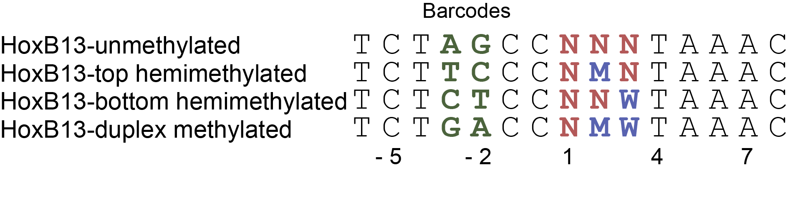

## Introduction

HoxB13, is a homeobox protein recently found to process methylation sensitivity and two distinct motifs, i.e., TCGTAAA and CAATAAA. To quantify this, I designed following randozmied dsDNA libraries covering the unmethylated, top hemimethylated, bottom hemimethylated, duplex methylated binding sites at positions 2 and 3 respectively by chemical synthesis, thus we can assay the strand-specific methyl-C contribution to the binding affinity of each site.




```{r include=FALSE}
require(dplyr)
require(stringi)
require(ggplot2)
require(ggrepel)
require(magrittr)
require(cowplot)
```

## Importing and preoprocessing data

```{r}
load("../data/HoxB13.RData")

(HoxB13 <- HoxB13 %>%
  dplyr::mutate("Bound/Unbound" = Bound/Unbound,
                Energy = -log(Bound/Unbound)))
  
```

## Building specificity model
```{r warning=FALSE}
HoxB13 %>%
  dplyr::filter(Property == "unmethylated") %>%
  TFCookbook::buildEnergyModel() %>%
  TFCookbook::getEnergyMatrix() %>%
  TFCookbook::addAnchorMatrix(anchor = "TAAA", position = 4, height = 0.25) %>%
  TFCookbook::plotEnergyLogo() +
  scale_y_continuous(breaks = seq(-0.8, 0.8, 0.2))
```

## Building methylation sensitivity model

It is easy to build methylation effect model by comparison of each methylated ste with its unmethylated counterpart
```{r warning = FALSE}
HoxB13.unmethylated <- subset(HoxB13, Property == "unmethylated")
HoxB13.methylated <- subset(HoxB13, Property %in% c("top Hemimethylated", "bottom Hemimethylated", "duplex Methylated"))

(HoxB13.paired <- left_join(HoxB13.methylated, HoxB13.unmethylated, by = "Sequence") %>%
  dplyr::mutate(Energy = Energy.x - Energy.y) %>%
  dplyr::select(Sequence,
                Property = Property.x，
                Energy))
```


Overall, we can create a compositive model to include both specificity and methylation effect
```{r warning=TRUE}

HoxB13.MethylModel <- HoxB13.paired %>%
  dplyr::mutate(Sequence = dplyr::case_when(
                                  Property == "top Hemimethylated" ~ stringi::stri_sub_replace(Sequence, from=2,to=2, replacement = "M"),
                                  Property == "bottom Hemimethylated" ~ stringi::stri_sub_replace(Sequence, from=3,to=3, replacement = "W"),
                                  Property == "duplex Methylated" ~ stringi::stri_sub_replace(Sequence, from=2,to=3, replacement = "MW")
                                  )
                ) %>%
  TFCookbook::buildMethylationModel()

HoxB13 %>%
  dplyr::filter(Property == "unmethylated") %>%
  TFCookbook::buildEnergyModel() %>%
  TFCookbook::getEnergyMatrix() %>%
  TFCookbook::addAnchorMatrix(anchor = "TAAA", position = 4, height = 0.25) %>%
  TFCookbook::addMethylMatrix(MethylModel = HoxB13.MethylModel, encoding = "(3+2)L+1") %>%
  TFCookbook::plotEnergyLogo()
```


## The existence of secondary motif and the necessity to use composite "Min" model to predict binding energy

Since among all unmethylated sequences, TCGTAAA has the lowest binding energy and hightest affinity, we can build a specificity model based on all those single variants to TCGTAAA as below. Using this model to predict the binding energy for all other sites and compare them with experimentally observed values, it is clear that small fraction of sequences, e.g., CAATAAA and CTATAAA, deviate significantly from the diagnoal lines, meaning that they are not properly represented in the energy model made by TCGTAAA and its single variants. The most intuitive explanation is that there exists another structural conformation for the recognition of DNA sequence CAATAAA and its related variants. We can build another model from CAAATAAA and its single variants, called HoxB13.CAA.Model as below. However, this "CAA" model still wouldn't explain all the observed values, particularly for sequence like TCGTAAA. Alternatively, if for each sequence we take the minimal value predicted by "TCG" and "CAA" models as the composite predicted value and compare it with the observed number, they match very well, so it is fair to say the TCG and CAA models are both required for proper understanding the specificity behavior of HoxB13 to its unmethylated sites.


```{r warning=FALSE}
HoxB13.TCG.Model <- HoxB13 %>%
  dplyr::filter(Property == "unmethylated") %>%
  TFCookbook::selectVariants(reference = "TCGTAAA", maxMismatches = 1) %>%
  TFCookbook::buildEnergyModel()

HoxB13 %>%
  dplyr::filter(Property == "unmethylated") %>%
  mutate(Predicted.Energy = TFCookbook::predictEnergy(Sequence, HoxB13.TCG.Model),
         Mismatch.TCG = as.factor(TFCookbook::countMismatch(Sequence, "TCGTAAA"))) %>%
  ggplot(aes(x = Predicted.Energy, y = Energy, label = Sequence, color = Mismatch.TCG, shape = Mismatch.TCG)) +
  geom_abline(slop = 1, linetype = "dashed") +
  geom_point(size = 2) +
  geom_text_repel(data = function(x) filter(x, ((Predicted.Energy - Energy) > 2) & (Energy < 0.8)), show.legend = FALSE) +
  xlab("Predicted binding energy by model of single variants of TCGTAAA (kT)") +
  ylab("Observed binding energy (kT)") + ylim(-2, 2) +
  labs(color = "Mismatches to TCGTAAA", shape = "Mismatches to TCGTAAA")
```

```{r fig.height=5, fig.width=15, warning=FALSE}
HoxB13.CAA.Model <- HoxB13 %>%
  dplyr::filter(Property == "unmethylated") %>%
  TFCookbook::selectVariants(reference = "CAATAAA", maxMismatches = 1) %>%
  TFCookbook::buildEnergyModel()

HoxB13 %<>%
  dplyr::filter(Property == "unmethylated") %>%
  dplyr::mutate(Mismatch.TCG = as.factor(TFCookbook::countMismatch(Sequence, "TCGTAAA")),
                Mismatch.CAA = as.factor(TFCookbook::countMismatch(Sequence, "CAATAAA")),
                Predicted.Energy.TCG = TFCookbook::predictEnergy(Sequence, HoxB13.TCG.Model),
                Predicted.Energy.CAA = TFCookbook::predictEnergy(Sequence, HoxB13.CAA.Model)) %>%
  dplyr::mutate(Predicted.Energy.min = pmin(Predicted.Energy.TCG, Predicted.Energy.CAA))

HoxB13 %>%
  ggplot(aes(x=Predicted.Energy.TCG, y=Energy, label=Sequence, color=Mismatch.TCG, shape = Mismatch.CAA)) +
  geom_abline(slop = 1, linetype = "dashed") +
  geom_point(size = 2, show.legend = FALSE) +
  geom_text_repel(data = function(x) filter(x, ((Predicted.Energy.TCG - Energy) > 2) & (Energy < 0.8)), show.legend = FALSE) +
  xlab("Predicted binding energy\n by model of single variants of TCGTAAA (kT)") +
  ylab("Observed binding energy (kT)") + ylim(-2, 2) -> plot.TCG
  
HoxB13 %>%
  ggplot(aes(x=Predicted.Energy.CAA, y=Energy, label=Sequence, color=Mismatch.TCG, shape = Mismatch.CAA)) +
  geom_abline(slop = 1, linetype = "dashed") +
  geom_point(size = 2, show.legend = FALSE) +
  geom_text_repel(data = function(x) filter(x, ((Predicted.Energy.CAA - Energy) > 1.5) & (Energy < 0.8)), show.legend = FALSE) +
  xlab("Predicted binding energy\n by model of single variants of CAATAAA (kT)") +
  ylab("Observed binding energy (kT)") + ylim(-2, 2) -> plot.CAA

HoxB13 %>%
  ggplot(aes(x = Predicted.Energy.min, y = Energy, label = substr(Sequence, 1,3), color = Mismatch.TCG, shape = Mismatch.CAA)) +
  geom_abline(slop = 1, linetype = "dashed") +
  geom_point(size = 2) +
  geom_text_repel(data=function(x) filter(x, (abs(Predicted.Energy.min - Energy) > -0.1) & (Energy < 1)), show.legend = FALSE) +
  xlab("Predicted binding energy\n by minimal value of TCGTAAA and CAATAAA models (kT)") +
  ylab("Observed binding energy (kT)") + ylim(-2, 2) +
  labs(color = "Mismatches to TCGTAAA", shape = "Mismatches to CAATAAA") -> plot.min

cowplot::plot_grid(plot.TCG, plot.CAA, plot.min, align = "h", ncol = 3, rel_widths = c(1,1,1.45))
```

